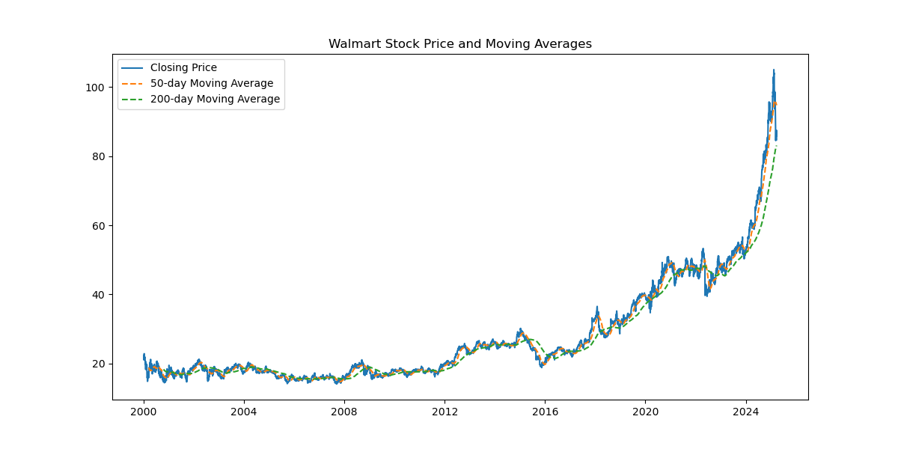
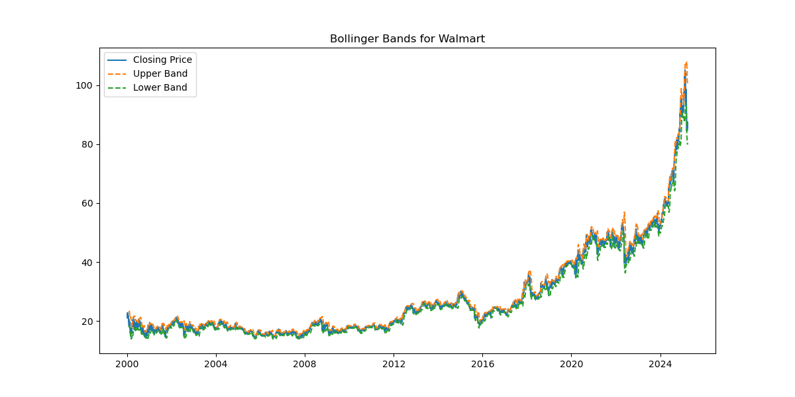
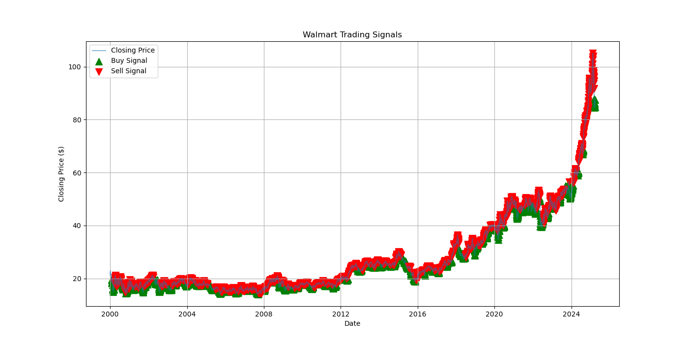
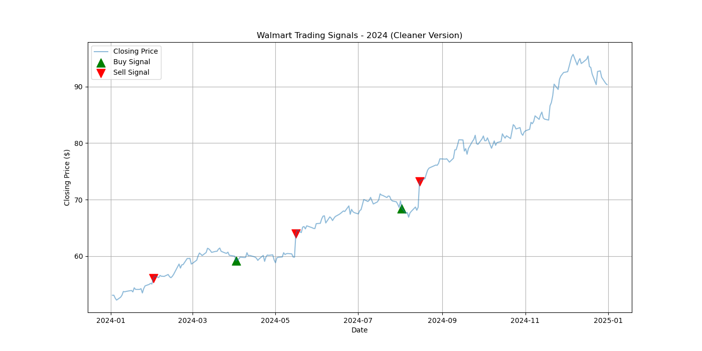
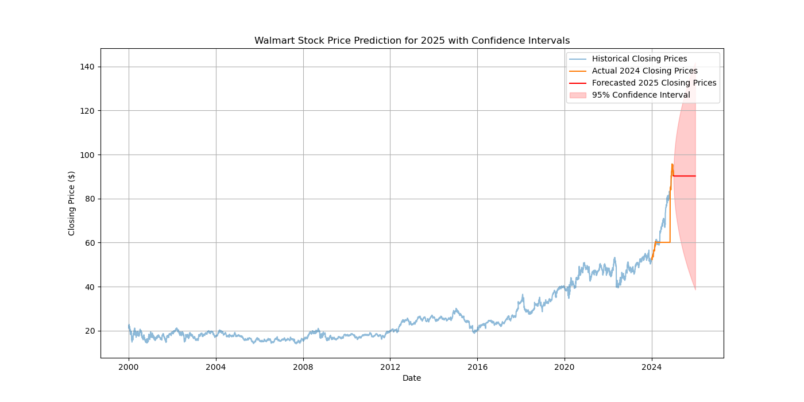

# 📈 Walmart (WMT) Algorithmic Trading Signals & 2025 Price Forecast

## The Pitch: Why This Matters to Investors
In the stock market, emotions are your worst enemy. This project attempts to strip away the noise and apply pure, data-driven logic to Walmart (WMT)—one of the most resilient blue-chip stocks on the market. 

By leveraging historical price action dating back to the year 2000, this analysis employs a **Mean Reversion Strategy** using Bollinger Bands to algorithmically identify optimal Buy and Sell pockets. Furthermore, it doesn't just look backward; it uses an ARIMA time-series model to forecast WMT's price trajectory through 2025. Whether you are a swing trader looking for technical entry points or a long-term investor mapping macroeconomic trends, this project translates raw daily market data into actionable signals.

---

## Technical Portfolio Showcase
This repository serves as a demonstration of full-cycle financial data analysis, from data wrangling to predictive modeling. 

**Core Competencies Demonstrated:**
* **Data Wrangling:** Handled a dataset of 6,345 records, executing datetime conversions, indexing, and data imputation utilizing `pandas`.
* **Algorithmic Logic:** Engineered programmatic trading signals (Buy = 1, Sell = -1) based on rolling statistical thresholds.
* **Time Series Forecasting:** Configured and deployed an Autoregressive Integrated Moving Average (ARIMA) model using `statsmodels` to project future asset valuations.
* **Data Visualization:** Built layered, publication-ready financial charts using `matplotlib` to communicate complex statistical boundaries (confidence intervals) clearly.

### The Dataset
The analysis is built on a highly robust and perfectly clean dataset of historical WMT daily prices.

| Metric | Value |
| :--- | :--- |
| **Total Trading Days** | 6,345 (Jan 2000 - Present) |
| **Data Integrity** | 0 Null Values, 0 Duplicates |
| **Historical Average Close** | $27.79 |
| **Peak Recorded Close** | $105.30 |

---

## Visual Insights & Strategy

### 1. Macro Trends: Moving Averages
Before looking at short-term volatility, we establish the macro trend. The chart below plots the daily closing price against the 50-day and 200-day moving averages, allowing traders to easily spot "Golden Crosses" (bullish) and "Death Crosses" (bearish).

### 2. Volatility & Mean Reversion: Bollinger Bands
To find our trading signals, we calculate a 20-day moving average and cast bands 2 standard deviations above and below it. In a mean-reverting strategy, prices touching the lower band suggest the asset is historically oversold, while the upper band suggests it is overbought. 

### 3. Algorithmic Execution: Trading Signals
Using the Bollinger Bands, the script generates algorithmic execution signals. 
* **Green Triangles (Buy):** The closing price dips below the lower band.
* **Red Triangles (Sell):** The closing price breaches the upper band.

**All-Time Performance:**

**Recent Performance (2024 Highlight):**
By isolating the data to 2024, we get a much cleaner look at how these signals behave in recent market conditions, effectively capturing swing trading opportunities during WMT's recent run-up.

---

## The 2025 Outlook: ARIMA Forecasting
To look forward, the project trains an ARIMA model `(order = 5, 1, 0)` specifically on the daily data from 2024 to learn the asset's most recent underlying momentum and volatility parameters. The model was then projected 365 days into the future to map 2025.

### Q1 2025 Forecast Snapshot
The model predicts early 2025 stability in the low $90s. The expanding red shaded area represents the **95% Confidence Interval**. In time-series analysis, the further out you predict, the wider the variance becomes due to compounding market uncertainties. 

| Date | Predicted Close | 95% Lower Limit | 95% Upper Limit |
| :--- | :--- | :--- | :--- |
| **2025-01-01** | $90.34 | $87.92 | $92.76 |
| **2025-01-02** | $90.31 | $86.81 | $93.81 |
| **2025-01-03** | $90.26 | $85.94 | $94.58 |
| **2025-01-04** | $90.25 | $85.22 | $95.29 |
| **2025-01-05** | $90.25 | $84.55 | $95.96 |

---

## How to Run This Project Locally
1. Clone this repository.
2. Ensure you have the required libraries installed: `pip install pandas matplotlib statsmodels`.
3. Update the CSV file path in `Walmart_stock_analysis.py` to match your local directory structure.
4. Run the script to generate all models and visualizations dynamically.
